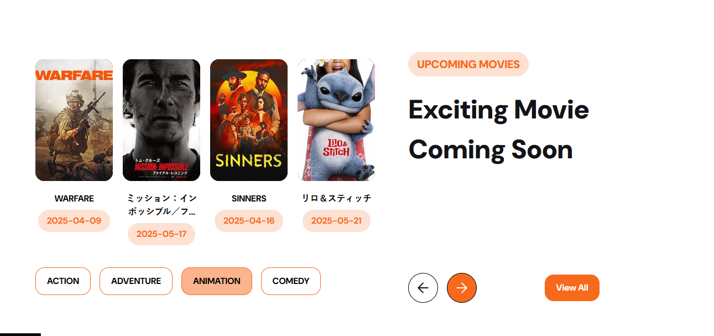
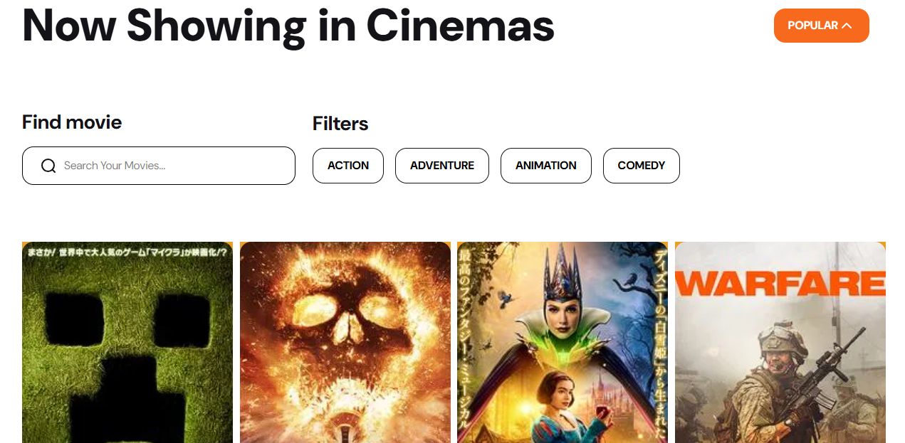
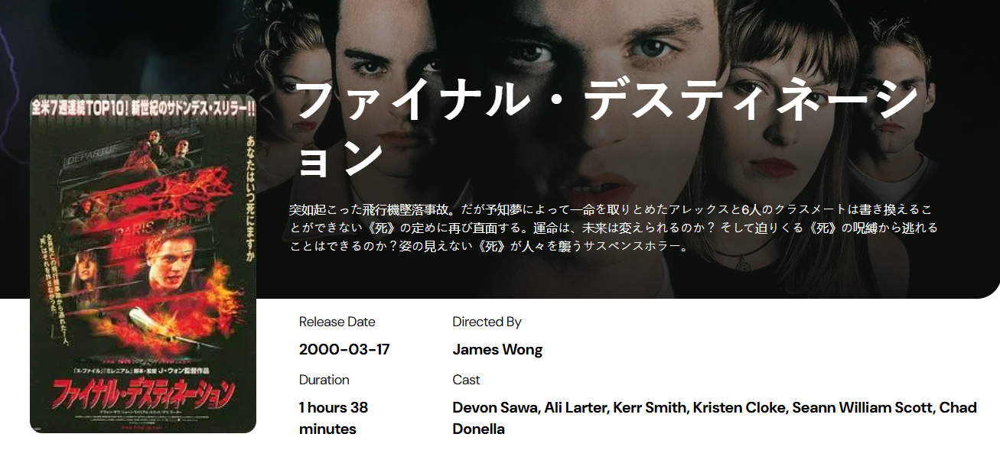

# Tickitz - Cinema Booking

Tickitz is a React-based web application designed to help users explore and discover movies currently showing in cinemas and upcoming releases. Powered by the The Movie Database (TMDB) API, Tickitz provides a seamless experience to browse movie details, including titles, posters, genres, and release dates. The application features a user-friendly interface with sections for now-playing movies, upcoming releases, and a comprehensive movie list, making it easy to stay updated on the latest cinema offerings.

## Preview






## Features
- Now Playing Section: Displays currently showing movies with posters, titles, and up to two genre tags per movie.

- Upcoming Movies Section: Showcases upcoming releases with release dates and dynamic genre buttons.

- Movie List Page: Presents a grid of movies with posters, titles, and genres, fetched dynamically from the TMDB API.


## Getting Started
1. Clone this project:
```
git clone https://github.com/ranandasatria/fgo24-react-form
```

2. Install the depedencies:
```
npm install
```

3. Run the project:
```
npm run dev
```

4. The project will be runnning at:
``` 
http://localhost:8080
```

## Depedencies

- React: Frontend framework for building the user interface.

- Vite: Fast development server and build tool for modern web applications.

- TMDB API: Provides movie data for now-playing, upcoming, and genre information.

- CSS: Custom styles with Tailwind-inspired classes for responsive design.

## How to contribute

Contributions are welcome! To contribute:

- Fork the repository.

- Create a new branch (git checkout -b feature/your-feature).

- Make your changes and commit (git commit -m "Add your feature").

- Push to your branch (git push origin feature/your-feature).

- Open a Pull Request (PR) for review.

## License

This project following MIT License.

## Copyright
&copy; 2025 Kodacademy


